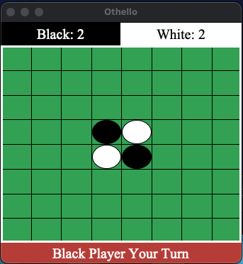

# :computer: Othello Game
This is a project that I created while attending UCI, it is a player vs player digital version of the famous board game Othello. The project was 
divided in to two parts, first build the game logic then create the graphical interface. The game has the option to have a board with 4x4 tiles that can range up to 16x16 tiles,
but defaults to the standard of 8x8. The game also has the option of choosing the first player and the type of win, either whoever has the most or least tiles conquered wins. The program consists of a Game Class that uses a multi-dimensional array to keep track of the amount of discs currently on the board. The game can be played on a terminal with a loop that constantly checks the state of the game and prints out the results. After each move the program updates the score of each player and changes the value of the conquered tiles. Using Tkinter the program is able to add a graphical user interface that interacts with the game logic and uses the Game Class to display the game to the user. With Tkinter the program's window can update the value of the current player, the scores of each individual player, and change the colors of the discs on the board after each move. Once the program detects that all
tiles have been conquered or that there is no longer any moves available the game is over. Once the game ends, a pop up window appears that gives the user the option to play again, which will lead them to the start up menu, or gives them the option to stop playing.

# :pencil2: What I learned
* Tkinter()
* Game Design
* Merging Gui & Game Logic
* Othello Rules

# :camera: Screenshots
Start Up Menu             |  Initial State
:-------------------------:|:-------------------------:
  |  
Progressed Game             |  Game Results
  |  

# :rocket: How to run  
  * python3 start_up_menu_gui.py
